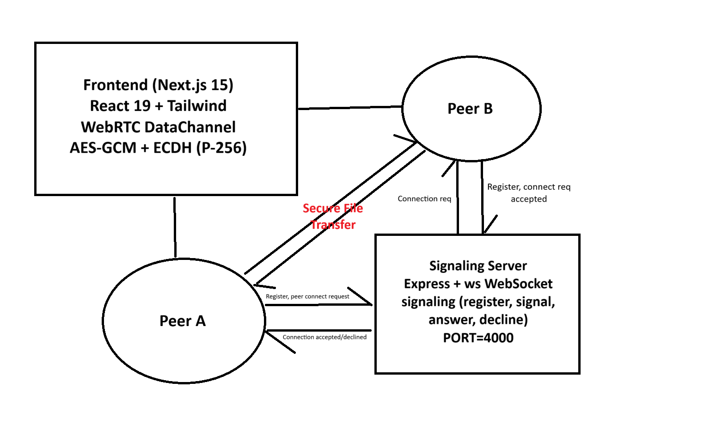

# VoidShare — P2P Encrypted File Sharing (WebRTC)

VoidShare is a minimal, privacy-first file transfer app that uses **WebRTC DataChannels** for peer‑to‑peer (P2P) transfer and **end‑to‑end encryption** (AES‑GCM) with ephemeral keys derived via **ECDH (P‑256)**. A tiny **WebSocket signaling server** (Express + `ws`) is used only to help peers discover each other and exchange offer/answer/ICE candidates. **No file data touches the server.**

<p align="center">
  
</p>

## ✨ Features

- 🔐 End‑to‑end encryption: AES‑GCM per transfer; AES key encrypted using ECDH‑derived shared secret
- 🔄 True P2P via WebRTC DataChannel (DTLS‑SRTP encrypted)
- 🧭 Lightweight signaling server (Express + `ws`) — stores no content
- 🧩 Backpressure-aware sending (bufferedAmount thresholds + queued chunks)
- 🧭 QR code pairing and peer‑ID connect
- 🎛️ Clean Next.js 15 UI with progress indicators & toasts

## 🧱 Repo Layout

```
.
├─ server.js                # WebSocket signaling server (Express + ws)
├─ package.json             # root scripts (dev/build/start)
├─ voidshareCompose.yaml    # Docker Compose (frontend + backend)
├─ Dockerfile               # Backend container
└─ frontend/                # Next.js 15 app
   ├─ app/page.js           # UI, file send/receive, crypto flows
   ├─ lib/server_utils.js   # WebRTC setup, signaling, buffer control
   ├─ lib/crypto_utils.js   # AES-GCM + ECDH helpers
   ├─ components/QrCode.js  # QR code pairing
   ├─ dockerfile            # Frontend container
   └─ package.json
```

## 🧰 Tech Stack

- **Frontend:** Next.js 15, React 19, Tailwind CSS, React-Toastify, QRCode
- **Backend:** Node.js (Express 5), `ws` WebSocket server, CORS
- **Crypto:** AES‑GCM (256‑bit), ECDH (P‑256), Web Crypto API

## ⚙️ Configuration

### Frontend (env)

- `NEXT_PUBLIC_SIGNALING_SERVER_URL` — WebSocket endpoint of the signaling server.  
  Examples:
  - Local dev (no TLS): `ws://localhost:4000`
  - Production (TLS): `wss://your-domain.example`

> The code defaults to `https://voidshareserver.onrender.com/` (hosted signaling server) if the env var is not set. For reliability, set the variable explicitly and **use `ws://` or `wss://` scheme**.

### Backend (env)

- `PORT` — defaults to `4000`

## ▶️ Running Locally (Node)

```bash
# Root: install deps for backend + (frontend separately)
npm install
cd frontend && npm install && cd ..

# Dev: runs server (nodemon) + Next.js app
# NOTE: requires nodemon installed (npm i -D nodemon) if not present.
npm run dev

# Production
npm run build           # builds frontend
npm start               # starts signaling server on PORT (default 4000)
# Start Next separately for production:
cd frontend && npm run start
```

### Frontend only (with custom signaling URL)
```bash
cd frontend
export NEXT_PUBLIC_SIGNALING_SERVER_URL=ws://localhost:4000
npm run dev
```

## 🐳 Docker & Compose

### Build & run with Docker Compose
```bash
docker compose -f voidshareCompose.yaml up --build
# Frontend: http://localhost:3000
# Backend (WS): ws://localhost:4000
```

### Build images manually
```bash
# Backend
docker build -t voidshare-server .
docker run -p 4000:4000 voidshare-server

# Frontend
docker build -f frontend/dockerfile -t voidshare-frontend ./frontend
docker run -p 3000:3000 -e NEXT_PUBLIC_SIGNALING_SERVER_URL=ws://host.docker.internal:4000 voidshare-frontend
```

> If deploying behind a reverse proxy (e.g., Nginx), ensure **WebSocket upgrade** headers are forwarded and use `wss://` in production.

## 🔌 Signaling Message Contract

All messages are JSON over WebSocket.

- **register** (client → server)  
  `{ "type": "register", "peerId": "<id>" }`

- **signal** (client → server)  
  `{ "type": "signal", "target": "<peerId>", "data": { "sdp" | "candidate" | "decline" | "answer" } }`

- **forwarded to target** (server → client)  
  `{ "type": "<'signal' | 'answer' | 'decline'>", "from": "<peerId>", "data": <payload> }`

- **error** (server → client)  
  `{ "type": "error", "message": "Peer ID ... not found." }`

## 🔒 Security Model

- WebRTC channels are **DTLS‑encrypted** end‑to‑end.
- For file payloads, VoidShare uses:
  - **AES‑GCM (256‑bit)** to encrypt the file bytes
  - Ephemeral **ECDH (P‑256)** to derive a shared secret; the generated AES key is encrypted with this shared secret and sent alongside metadata
  - Per‑transfer, random IVs
- The signaling server **never** sees file contents.

## 🚚 Transfer Flow (High Level)

1. **Connect**: Sender enters Friend ID (or scans QR); peers exchange SDP & ICE via signaling server.
2. **DataChannel opens**: Each side sends its **public ECDH key** over the encrypted channel.
3. **Encrypt** (sender): Generate AES key → encrypt file (AES‑GCM) → encrypt AES key using ECDH‑derived shared key → send metadata (name, size, IVs, encrypted AES key).
4. **Stream**: Send encrypted file in **32 KB** chunks with **buffer backpressure** (16 MB cap, 64 KB low watermark).
5. **Complete**: Sender sends `"__END__"`. Receiver assembles chunks, decrypts AES key, decrypts file, and saves.

## 🧪 Testing & Troubleshooting

- Verify WS connectivity in browser devtools (Network → WS).  
- If connection stalls, check that your proxy forwards WS upgrade headers.
- If P2P fails, try different networks or add a TURN server to `iceServers`.

## 📄 License

ISC License (see `package.json`).