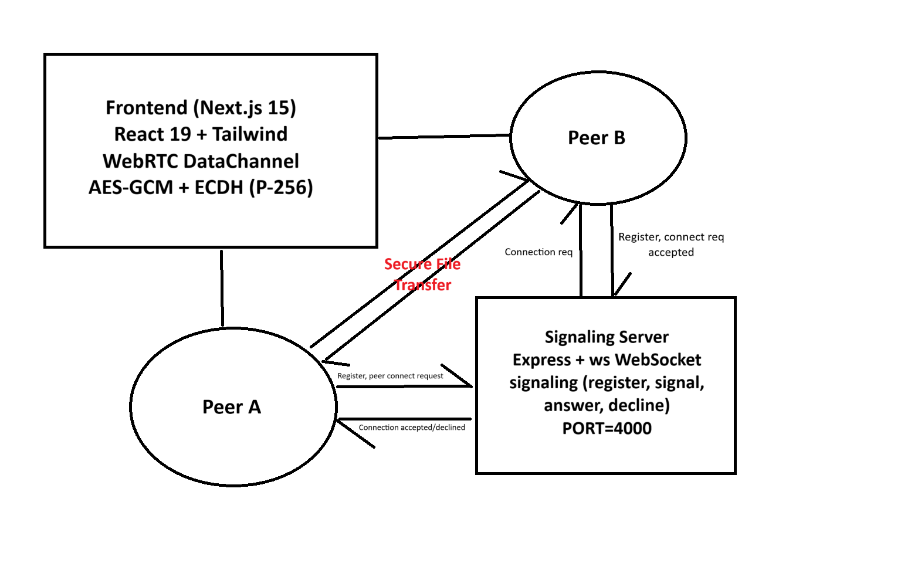

# ⚡ VoidShare — P2P Encrypted File Sharing (WebRTC)

VoidShare is a minimal, privacy-first file transfer app that uses **WebRTC DataChannels** for peer-to-peer (P2P) transfer and **end-to-end encryption** (AES-256-GCM) with ephemeral keys derived via **ECDH (P-256)**. A tiny **WebSocket signaling server** (Express + `ws`) only helps peers discover each other and exchange offer/answer/ICE candidates. **No file data ever touches the server.**

> **V2.0** — this release fixes the `EcdhKeyDeriveParams: public: Must be a CryptoKey` crash on send, and restructures the whole project into clean `server/` + `client/` packages with a componentized, restyled UI. See [`docs/VoidShare_V2_Report.pdf`](docs/VoidShare_V2_Report.pdf) for the full write-up.

## 🏗️ Architecture



## ✨ Features

- 🔐 End-to-end encryption: AES-256-GCM per transfer; the one-time file key is itself encrypted with an ECDH-derived shared secret
- 🔄 True P2P via WebRTC DataChannel (DTLS-SRTP encrypted transport)
- 🧭 Lightweight signaling server (Express + `ws`) — stores no content, ever
- 🧩 Backpressure-aware sending (bufferedAmount thresholds + queued chunks)
- 🔑 Symmetric key exchange fixed: both peers send their public key the instant their DataChannel opens, and the UI won't let you send until the secure channel is actually confirmed ready
- 🧭 QR code pairing and peer-ID connect
- 🎨 Restyled Next.js 15 UI: glass-panel cards, live connection/key status indicators, lucide icons

## 🧱 Repo Layout

```
.
├─ docs/                       # architecture diagram + V2.0 PDF report
├─ server/                     # WebSocket signaling server (Express + ws)
│  ├─ index.js
│  ├─ package.json
│  └─ Dockerfile
└─ client/                     # Next.js 15 app
   ├─ src/
   │  ├─ app/
   │  │  ├─ page.js            # thin composition of hook + components
   │  │  ├─ layout.js
   │  │  ├─ globals.css
   │  │  └─ devlogs/page.js
   │  ├─ components/           # Header, PeerIdCard, ConnectPanel, FileTransferPanel,
   │  │                         # ProgressBar, QrCode, LoadingScreen
   │  ├─ hooks/
   │  │  ├─ useVoidShare.js     # connection state, key exchange, transfer pipeline
   │  │  └─ useBackendWarmup.js
   │  └─ lib/
   │     ├─ signaling.js        # WebRTC + WebSocket signaling (bug-fixed)
   │     └─ crypto.js           # AES-GCM + ECDH helpers
   ├─ package.json
   └─ Dockerfile
```

## 🧰 Tech Stack

- **Frontend:** Next.js 15, React 19, Tailwind CSS 4, react-toastify, lucide-react, qrcode
- **Backend:** Node.js, Express 5, `ws` WebSocket server, CORS
- **Crypto:** AES-256-GCM, ECDH (P-256), Web Crypto API

## ⚙️ Configuration

### Client (env, in `client/.env.local`)

- `NEXT_PUBLIC_SIGNALING_SERVER_URL` — WebSocket endpoint of the signaling server.
  - Local dev (no TLS): `ws://localhost:4000`
  - Production (TLS): `wss://your-domain.example`

If unset, the app falls back to a hosted demo signaling server. For reliability, set this explicitly and use the `ws://`/`wss://` scheme (not `http(s)://`).

### Server (env)

- `PORT` — defaults to `4000`

## ▶️ Running Locally

```bash
# Signaling server
cd server
npm install
npm run dev          # or: npm start

# Client (separate terminal)
cd client
npm install
export NEXT_PUBLIC_SIGNALING_SERVER_URL=ws://localhost:4000
npm run dev
```

Open http://localhost:3000, copy your Peer ID (or QR code) to a friend, have them paste it into "Enter friend's Peer ID" and hit Connect.

### Production

```bash
cd server && npm install && npm start
cd client && npm install && npm run build && npm run start
```

## 🐳 Docker & Compose

```bash
docker compose up --build
# Client:  http://localhost:3000
# Server:  ws://localhost:4000
```

Build images manually:

```bash
# Server
docker build -t voidshare-server ./server
docker run -p 4000:4000 voidshare-server

# Client
docker build -t voidshare-client ./client
docker run -p 3000:3000 -e NEXT_PUBLIC_SIGNALING_SERVER_URL=ws://host.docker.internal:4000 voidshare-client
```

> Deploying behind a reverse proxy (e.g. Nginx)? Make sure WebSocket **upgrade** headers are forwarded, and use `wss://` in production.

## 🔌 Signaling Message Contract

All messages are JSON over WebSocket.

- **register** (client → server): `{ "type": "register", "peerId": "<id>" }`
- **signal** (client → server): `{ "type": "signal", "target": "<peerId>", "data": { "sdp" | "candidate" } }`
- **forwarded to target** (server → client): `{ "type": "signal" | "answer" | "decline", "from": "<peerId>", "data": <payload> }`
- **error** (server → client): `{ "type": "error", "message": "Peer ID ... not found." }`

## 🔒 Security Model

- WebRTC channels are **DTLS-encrypted** end-to-end at the transport level.
- On top of that, VoidShare adds application-layer encryption for file payloads:
  - **AES-256-GCM** encrypts the file bytes, with a fresh, random one-time key per transfer.
  - Ephemeral **ECDH (P-256)** key pairs (one per browser session) are exchanged the moment the DataChannel opens; both sides derive the same shared secret.
  - The one-time file key is itself encrypted with that shared secret before being sent, alongside metadata (name, size, IVs, SHA-256 hash).
  - Per-transfer, cryptographically random IVs.
- The signaling server **never** sees file contents, file keys, or the shared secret — only SDP/ICE handshake data.

## 🚚 Transfer Flow (High Level)

1. **Signal**: Sender enters the friend's Peer ID (or scans their QR code); peers exchange SDP & ICE candidates via the signaling server.
2. **DataChannel opens**: Each side immediately sends its public ECDH key over the (already DTLS-encrypted) channel — independently of the other side, so there's no ordering dependency.
3. **Secure channel ready**: once both sides hold the other's public key, the UI unlocks the Send button.
4. **Encrypt** (sender): generate a one-time AES key → encrypt the file (AES-GCM) → encrypt that AES key with the ECDH-derived shared key → send metadata (name, size, IVs, encrypted key, hash).
5. **Stream**: send the encrypted file in 32 KB chunks with buffer backpressure (16 MB cap, 64 KB low watermark).
6. **Complete**: sender sends `"__END__"`; receiver assembles chunks, decrypts the file key, decrypts the file, verifies its SHA-256 hash, and downloads it.

## 🧪 Testing & Troubleshooting

- Verify WebSocket connectivity in browser devtools (Network → WS).
- If the connection stalls, check that your reverse proxy forwards WS upgrade headers.
- If P2P fails on restrictive networks, add a TURN server to the `iceServers` list in `client/src/lib/signaling.js`.
- If Send File stays disabled, wait a moment — the "Secure channel ready" pill needs both peers' public keys to arrive over the DataChannel first.

## 📄 License

ISC License (see `package.json` in `server/` and `client/`).